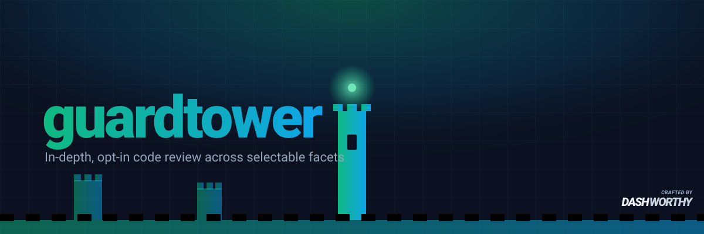

# guardtower



Standalone, in-depth, **opt-in** code review for Claude Code.

Point it at a change — a diff, a branch, or a PR — and it decides which review **facets** the
change warrants (security, concurrency, data-safety, API compatibility, and more), dispatches each
as an independent, self-limiting reviewer, and reconciles everything into **one markdown report**. It is
**report-only**: it tells you what each facet found and never edits your code.

This is the heavier, deliberate review — not an everyday pass and not an automatic gate. Someone
decides a change is worth a deep look and runs it.

## Install

guardtower ships manifests for both Claude Code (`.claude-plugin/`) and Codex (`.codex-plugin/` +
`.agents/plugins/marketplace.json`), sharing one skill tree.

**Claude Code:**

```
/plugin marketplace add dashworthy/guardtower
/plugin install guardtower@guardtower
```

**Codex:**

```
/plugin marketplace add dashworthy/guardtower
/plugin install guardtower
```

Then invoke the `guardtower` skill in either. guardtower depends on no other plugin.

## Use

Invoke the skill:

```
/guardtower:guardtower
```

It accepts two optional arguments, in either order:

- **effort** — `low` | `medium` | `high` | `max`. One dial trading breadth for signal: `low` returns
  only the strongest findings per facet; `max` is the widest pass. Omitted, guardtower asks for it
  as a structured choice with a recommended level based on the change.
- **target** — what to review: a PR/MR link or number, a branch, a diff, or a path. Omitted, it
  reviews the working diff / current branch. A PR target is what makes posting findings back
  possible where a facet supports it.

Example:

```
/guardtower:guardtower high #142
```

A run then goes:

1. **Effort** — if you didn't pass one, guardtower asks with a four-option choice (`low` / `medium`
   / `high` / `max`), the recommended level first. It recommends `high` for risky surfaces (auth,
   untrusted input reaching a query, money, migrations, concurrency, tenancy, public contracts),
   `low` for a small change touching none of them, `medium` otherwise.
2. **Facets** — guardtower picks the facets from what the change does and runs them. It announces
   the set; it does not ask you to pick.
3. **Report** — written into the run directory; guardtower prints its path.

## What you get

A single reconciled markdown report. Every file a run writes goes in one directory per run:

```
.guardtower/{date}-{run-name}/{artifact}.md
```

For example `.guardtower/2026-09-23-pr-142/report.md`. The
run name comes from the target (`pr-142`, a branch slug, a path's last segment, or the current
branch); a second run on the same day gets `-2`, `-3`, …. guardtower doesn't touch `.gitignore` —
add `.guardtower/` there if you don't want reports committed.

Every report uses the same handoff layout, ready to paste into a PR: findings grouped by theme, and
for each one the **evidence** (cited `file:line`) that it's real, the **current code**, a **proposed
fix**, and **why it fixes it**. A **Review scope**
section at the end lists the effort, the facets run (and why), the facets skipped, and each facet's
verdict. Where a
facet's cap held findings back, the report says how many wait behind it so you know to re-run.

## The facets

Fourteen lenses, each defined under `skills/guardtower/references/facets/<facet>/facet.md`. Eight
**core** facets run on every change; the rest are selected automatically only when the change — or the repo's
detected stack/tenancy — makes them relevant.

| Facet | What it checks | Runs |
|---|---|---|
| `reviewing-security` | OWASP best practices; authorization enforced, not assumed; Electron process-model security when relevant | Always (core) |
| `reviewing-technical` | Efficiency & correctness (N+1, unbounded queries) and reuse over reinvention | Always (core) |
| `reviewing-architectural` | Coupling, dependency direction, cohesion, leaky abstractions | Always (core) |
| `reviewing-readability` | Unearned abstraction and over-defensive programming | Always (core) |
| `reviewing-error-handling` | Silent failures, swallowed exceptions, bad fallbacks | Always (core) |
| `reviewing-test-quality` | Do tests exercise the change and fail if it breaks? | Always (core) |
| `reviewing-concurrency` | Race conditions: check-then-act, non-atomic read-modify-write, missing lock/transaction | Always (core) |
| `reviewing-numeric-precision` | Float for money, silent rounding, unit mismatch, overflow, lossy cast | Always (core) |
| `reviewing-data-safety` | Destructive/irreversible ops, migrations, data loss | When the change alters stored-data structure or does a destructive/bulk operation |
| `reviewing-api` | Compatibility of a contract it provides; consumption safety of a remote API it calls | When the change alters a public contract or consumes a remote API |
| `reviewing-idempotency` | Side effects unsafe to run twice: no key, non-idempotent retry, duplicate on replay | When the change adds a retryable/at-least-once/replayable side effect |
| `reviewing-tenant-isolation` | Cross-tenant leaks, branched on DB topology (shared-schema vs isolated-DB) | When the repo is detected multi-tenant |
| `reviewing-frontend` | Accessibility, data-presentation identity ambiguity, internationalization | When the change alters a user-facing surface |
| `reviewing-framework-best-practices` | Stack-specific idiom violations for the detected framework(s) | When a covered stack is detected |

## License

MIT © Andrew Leach
